<!--  -->

This project provides a system that uses annotations on provided data and SVG file to create a dynamic vector graphic.

## Usage

Include the dynamic vector graphic library in your html page:

```html
<script src="https://unpkg.com/dynamic-vector-graphics/dist/dvg.min.js"></script>
```

Either create the graphic by providing an existing svg element from the DOM:

```js
const elem = document.getElementById('mysvg')
const graphic = new dvg.DVG(elem)
```

Or provide a container element and provide a URL to the svg file to load:

```js
const elem = document.getElementById('container')
const graphic = new dvg.DVG(elem, { svg: './graphic.svg' })
```

Use the `update()`method to pass data to the graphic as desired. Can be a CSV string:

```js
graphic.update(csv)
```

Or can be a data structure:

```js
graphic.update({
  values: [
    ['A', 'B', 'C'],
    [1, 2, 3],
  ],
  columns: ['Character', 'Number'],
})
```

See the [examples page](./examples/) for demonstrations of various ways to instatiate dynamic graphics and apply data.

## Creating an Annotated SVG

To make your SVG file dynamic it must be correctly annotated. Any vector editing software that allows the ids of the elements to be set by the user may be used to add the annotations.

<sub><sup>**Adding Annotation to SVG Element Id**</sup></sub><br/>
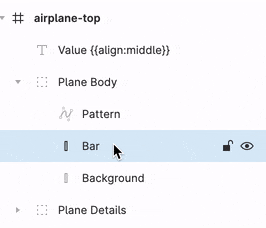

Different SVG editors have different export behavior, but be sure through the export options that these three things are true:

- The ids are exported into the SVG.
- Elements that aren't visible are still exported.
- Text is not converted into fixed outlines (if you want the text to be dynamic).

In order to allow dynamic loading of fonts we currently only support [Google Fonts](https://fonts.google.com/) in the dynamic SVGs. The system will automatically look up and load any fonts you use and results will match as long as you download and use the Google font locally for your design. Some tools like Figma automatically use the Google Font library which is convenient.

### Adobe Illustrator Guide

Illustrator has a few ways to create SVG output. In order to preserve IDs and create the correct output you should use the File > Save a copy... action and set the format to "SVG (svg)". You will then be shown the "SVG Options" dialog and should use these settings:

- SVG Profiles: SVG 1.1
- Fonts
  - Type: SVG
  - Subsetting: None
- Options
  - Image Location: Embed
- Advanced Options
  - CSS Properties: Presentation Attributes
  - Output fewer tspan elements: True
  - Use textPath element for Text on Path: True
  - Responsive: True

### Figma Guide

Figma's export feature is applied to frames directly. First select the frame to export then under the "Export" section of options add a new export target, set the type to SVG, and use these settings (found in the overflow menu):

- Include "Id" attribute: True
- Outline Text: False

## General Annotation Syntax

The general syntax for all the annotations is that they are contained within double curly braces`{{…}}`, contain a list of parameters delimited by pipe characters `{{…|[PARAM]|[PARAM]|[PARAM]|…]}}`, and some parameters accept a simplified JSON-style syntax of comma delimited key value pairs separated by a colon where the value can be optional `{{[PARAM]|[…,KEY:[VAL],KEY:[VAL],…]}}`.

In this system, there are only two forms of this syntax in use in the annotations. The first is a single value parameter form `{{PARAM}}` and the other is a form that takes a single value as the first parameter and the second as a list of key-value pairs of options `{{PARAM|KEY:VAL,KEY,KEY:VAL}}`.

### Column References

The primary feature of this system is the ability to map a column in a data table to the attributes of an SVG element using only the id of the element in your preferred vector editor. Therefore, making references to a column is a key part of the syntax. Say that the SVG will be responding to this simple data table (the data range annotations are covered in a later section):

| Expenses {{0..1000}} | Revenue {{0..1000}} | Department | Year |
| -------------------- | ------------------- | ---------- | ---- |
| 765.4                | 843.2               | Toys       | 2020 |

If you wanted to make the reference be exactly to a column then you can reference it by name. In this case you could map the scale option to Expenses using this annotation: `{{scale:Expenses}}`. Note that the name is considered to be the columns name with the range annotation removed and any leading or trailing whitespace trimmed.

If you want your dynamic illustration to be more flexible and be able to use a column regardless of its name then you can reference it by type and index using the following conventions.

`#I` <br/>
The `#` character indicates a numeric type and `I` provides the zero-based index of the column. For example, `#0` would reference the Expenses column in the sample table and `#1` would reference the Revenue column.

`@I` <br/>
The `@` character indicates a character type and `I` provides the zero-based index of the column. For example, `@0` would reference the Department column in the sample table.

`$I` <br/>
The `$` character indicates a date type and `I` provides the zero-based index of the column. For example, `$0` would reference the Year column in the sample table.

`?I` <br/>
The `?` character indicates any type and `I` provides the zero-based index of the column. For example, `?2` would reference the Department column in the sample table.

### Ranges and Coordinates

In cases where a parameter or value is a numeric range or a coordinate there are a few ways to represent them: `0..1000`, `0to1000`, or `0;1000`.

The use of `..` or `to` are equivalent and will accept negative values. The use of `;` will result in the numbers being taken by their absolute value. The reason for this difference is to help with the way that many vector editors will encode the ids of the layers. Because a space character is not valid for an id in many parsers the editors will replace them with `_` or `-` characters when exported. This creates an issue since if in the editor an element is named `My Rect {{ origin :-5 .. 7 }}` what the system will receive is `My-Rect-{{-origin-:-5-..-7-}}`. The information about the fact that the first value is negative and the second is positive cannot be recovered. The special treatment of `;` is included so that for a case like `My Rect {{ origin : .5 ; 1 }}` all `-` characters are treated as if they were whitespace, allowing the syntax to remain whitespace insensitive at the expense of the ability to represent negative values.

## Data Annotation Syntax

As much as possible the system tries to keep all annotation context contained within the SVG file. However, for numerics, it is not always the case that the current minimum and maximum value in the data is the range in which it should be displayed. Therefore some annotations have to be provided in the data itself.

`NAME {{MIN..MAX}}` <br/>
In order to tell the dynamic object what the correct minimum and maximum for numeric columns should be the name of the data item itself must be annotated in Visual Analytics. This is done by including the range expression within a double brace annotation anywhere in the name. The annotation will be removed and so will not be part of the displayed name.

As an example a data item with the name `Expenses` would need to be renamed `Expenses {{0..1000}}` in order for it to be successfully understood by the dynamic SVG system.

<sub><sup>**Adding Range Annotation to Data**</sup></sub><br/>


## SVG Annotation Syntax

`{{[NAME]|(…,[OPT]:[VAL],…)}}` <br/>
All element annotations follow the pattern of first having an optional `NAME` which should be followed by a `|` if additional options will be specified. If there will be no options the `|` should be omitted. The `NAME` will be used as an identifier when annotations need to reference another and so should be unique. If they are not unique then the last one defined in the parse order of the SVG will take precedence.

If options are provided without a name the `|` should also be omitted. The structure of the options follows JSON notation conventions with the exception of not requiring strings be quoted and also assuming that the presence of only an option name indicates a true boolean value.

### Text

The text annotations allow control over the content and response to dynamic changes of text elements.

#### **Templating**

Templating annotations are used to dynamically modify the characters of the text and so are the only annotations that are included visibly within the SVG design.

<sub><sup>**SVG Source**</sup></sub><br/>
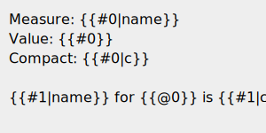

<sub><sup>**Result**</small><br/>
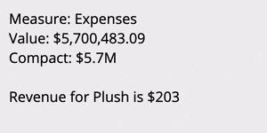

`{{COLUMN}}` <br/>
These annotations must be placed within the text content of a `<text>` or `<tspan>` element. They are simplified from the standard syntax in that they are not allowed to be assigned a name. In place of of the name the annotation may simply contain a reference to the `COLUMN` to insert the value from.

`{{COLUMN|c}}` <br/>
Adding the `c` option to the annotation will result in the column's value being presented using the compact version of its format. This is ignored for non-numerics.

`{{COLUMN|name}}` <br/>
Adding the `name` option to the annotation will result in the name of the column being inserted instead of its value. This is useful for cases where the dynamics are not set to specific columns and instead are provided by index position.

#### **Alignment**

The SVG format generated by many vector editors does not include text alignment. Therefore the desired alignment of the text must be provided via an annotation.

<sub><sup>**SVG Source**</sup></sub><br/>
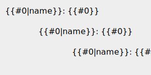

<sub><sup>**Result**</sup></sub><br/>
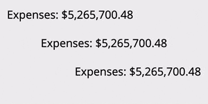

`{{…,align/a:start/middle/end,…}}`<br/>
The default alignment is start, which is to the left on LTR locales. The alignment works by taking the bounding box of the text before any changes are made to the text and using that to determine where the start, middle, or end is. Meaning that in the SVG file the initial left, middle, or right edge of the text element is used for the alignment.

### Transform

The transform annotations allow an object to have its position, rotation, and scaling be mapped to data dynamically. Multiple transforms can be used but can rapidly become complex.

While typically you would specify the transforms in a particular order in which they should be applied, this system has a fixed order for the transforms that avoids common pitfalls. That order is scale, rotate, and then position.

#### **Origin**

The origin annotation is used by both the scale and rotate transforms to determine how to apply the transform.

<sub><sup>**SVG Source**</sup></sub><br/>
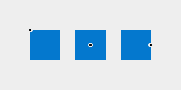

<sub><sup>**Result**</sup></sub><br/>
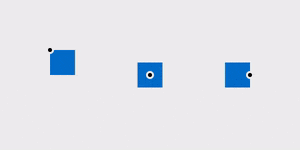

`{{…,origin/o:X;Y,…}}`<br/>
The origin of all transforms is by default the upper left of the element's bounding box unless specified otherwise. This option allows the origin for transforms to be positioned anywhere within the element's bounding box. The `X` and `Y` value may be any number between `0.0` and `1.0` inclusive and represent the proportion from the element's upper left to bottom right corner at which to place the origin.

#### **Scale**

The scale annotations are used to change the size of elements dynamically based on numeric data values.

<sub><sup>**SVG Source**</sup></sub><br/>
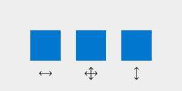

<sub><sup>**Result**</sup></sub><br/>
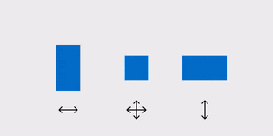

`{{…,scale/s:COLUMN,…}}`<br/>
The scale transform scales the element in both the horizontal and vertical direction such that the element is at its initial size when `COLUMN` is at its maximum value and is scaled to 0% when `COLUMN` is at its minimum value.

`{{…,scaleX/sx:COLUMN,…}}`<br/>
The scale x transform scales the element in only the horizontal direction such that the element is at its initial width when `COLUMN` is at its maximum value and is scaled to 0% when `COLUMN` is at its minimum value.

`{{…,scaleY/sy:COLUMN,…}}`<br/>
The scale y transform scales the element in only the vertical direction such that the element is at its initial height when `COLUMN` is at its maximum value and is scaled to 0% when `COLUMN` is at its minimum value.

#### **Rotate**

<sub><sup>**SVG Source**</sup></sub><br/>
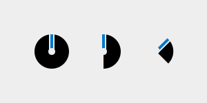

<sub><sup>**Result**</sup></sub><br/>
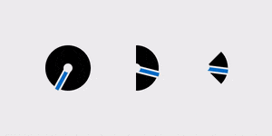

The rotate annotations are used to change the rotational orientation of elements dynamically based on numeric data values.

`{{…,rotate/r:COLUMN` `,…}}`<br/>
The rotate transform rotates the element such that the element is at its initial rotation when `COLUMN` is at its minimum value and is, by default, rotated 1 revolution clockwise when `COLUMN`\ is at its maximum value.

`{{…,rotateRatio/rr:RATIO,…}}`<br/>
The rotate ratio provides the amount of a single revolution for the rotation to occur within. A `RATIO` of `0.5` would for example rotate the object from 0 to 180 degrees.

#### **Position**

The position annotations are used to change the onscreen position of elements dynamically based on numeric data values.

<sub><sup>**SVG Source**</sup></sub><br/>
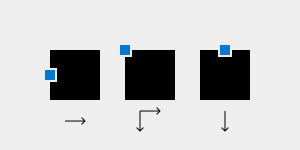

<sub><sup>**Result**</sup></sub><br/>
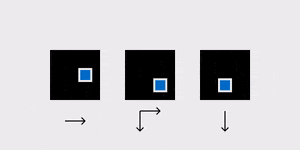

Special behavior is given to guides that can be used to define a path for the motion.

<sub><sup>**SVG Source**</sup></sub><br/>
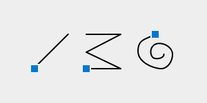

<sub><sup>**Result**</sup></sub><br/>
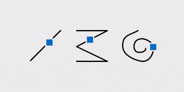

`{{…,position/p:COLUMN,…}}`<br/>
The position transform translates the element in both the horizontal and vertical direction based on the associated guide element such that the element is at its initial position when `COLUMN` is at its minimum value and is translated to the end of the guide when `COLUMN` is at its maximum value.

`{{…,positionX/px:COLUMN,…}}`<br/>
The position x transform translates the element in only the horizontal direction based on the associated guide element such that the element is at its initial position when `COLUMN` is at its minimum value and is translated to the end of the guide when `COLUMN` is at its maximum value.

`{{…,positionY/py:COLUMN,…}}`<br/>
The position y transform translates the element in only the vertical direction based on the associated guide element such that the element is at its initial position when `COLUMN` is at its minimum value and is translated to the end of the guide when `COLUMN` is at its maximum value.

`{{…,guide/g:NAME,…}}`<br/>
The guide option is required for the position transform to function. The guide is specified by providing the `NAME` which is assigned to an element via its id. For example, for `<rect id="My Rect {{Guide01}}"/>` the name of the element that should be used in the guide option is `Guide01`. Different elements are treated differently as guides. The default is to use the width and height of the bounding box of the element as the amount of the translation. A `<line>` element uses the offset from its start to it's end, meaning that it can be oriented in any direction while a `<rect>` when used as a guide will always result in a translate occurring to the right and down. More freeform elements like a `<path>` and `<polyline>` result in the translation happening along the path they represent.

<!--  -->
